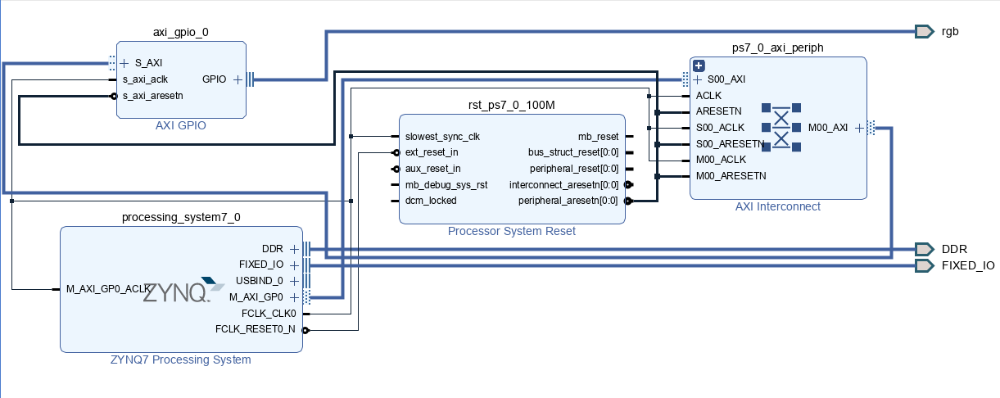
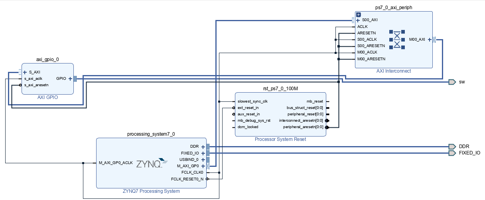
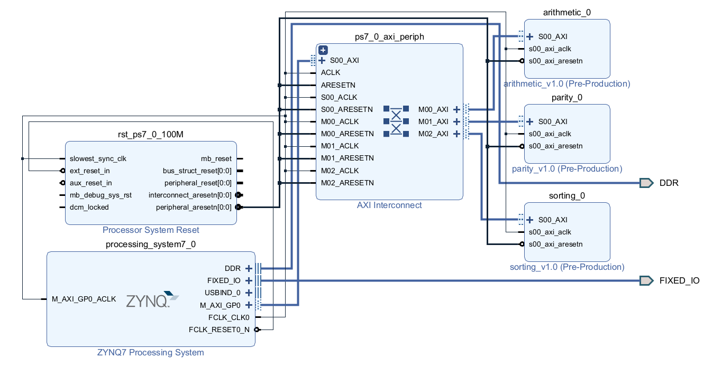

# FPGA-Sorting

>  2022 Spring  NCKU FPGA Course
>
>  Homework 3 Set calculation
>
>  E24076239 E24076297 E24076750

## Problem 1

### Introduction

Construct a system with a **ZYNQ processor** and **AXI GPIO** to control the RGB LEDs through the **Processing System (PS)**. 

### Specification

The colors appear in the following order:

* Red&rarr;Orange&rarr;Yellow&rarr;Green&rarr;Blue&rarr;Purple&rarr;Red&rarr;...

| Color           | Red     | Orange  | Yellow  | Green   | Blue    | Purple  |
| --------------- | ------- | ------- | ------- | ------- | ------- | ------- |
| **Hex Triplet** | #FF0000 | #FF6100 | #FFFF00 | #00FF00 | #0000FF | #7F1FFF |

### Detail

Define the **PWM** value of each color in `red_arr`, `green_arr`, and `blue_arr`. Each color has its own state, the double `for` loops are used to control the duration of each state and the corresponding RGB output color. The inner loop controls the output color of RGB LED by PWM value, and the outer loop controls the duration of each state(runs `ROUND` times).

### Block Design



## Problem 2

### Introduction

Use a **ZYNQ processor** and **AXI GPIO IP** to implement a **sorting algorithm** which is written by **C/C++**. 

### Specification

* Enter twenty non-negative integers by keyboard, and use `Enter` to separate each entered number
* If switch is **0**, the input integers are sorted in **ascending order**, **otherwise sort them in descending order**

### Algorithm

Use **insertion sort** to implement the sorting procedure.

```c++
int key, j;
for (int i = 0; i < 20; ++i) {
    key = input_arr[i];
    j = i - 1;
    while (j >= 0 && input_arr[j] > key) {
        input_arr[j + 1] = input_arr[j];
        j = j - 1;
    }
    input_arr[j + 1] = key;
}
```

### Block Design



## Problem 3

### Introduction

Designing the following three circuits and integrating them in a single block design:

* **Arithmetic**

  Input the **8-bit operands** and a **2-bit operator** from the processor, then return the calculated result. The operation may be **addition, subtraction, or multiplication**.

* **Sorting**

  Implement **counting sort** by this circuit. The input is a **32-bit vector** which is a combination of **eight 4-bit integers**.

* **Parity Generator**

  Return the **even** parity bit of a 32-bit input.

### Modules

#### Arithmetic

* Inputs
  * `input signed [7:0] a_i`: the first operand
  * `input signed [7:0] b_i`: the second operand
  * `input [1:0] operator_i`: `0` for addition, `1` for subtraction, and `2` for multiplication
* outputs
  * `output reg signed [7:0] result_o`: the result of calculation
  * `output reg overflow`: outputs `1'b1` if overflow

**Overflow detection** is considered in this module. While doing addition and subtraction, checking the sign of input operand and output data to determined if overflow occurs. If the operation is multiplication, use a larger register `reg [15:0] result` to store the product. Since the two input operands are signed, it automatically does a sign extension after multiplication, then we can check if `result[15:7]` are the same.

#### Sorting

* Inputs
  * `input clk_i`: clock
  * `input rst_ni`: negative triggered asynchronous reset
  * `input start_clear_i`: the module starts sorting while receiving high, or clear the data while receiving low
  * `input [31:0] nums_i`: contains **eight 4-bit input non-negative integers**
* Outputs
  * `output reg valid_o`: pulls high while finishing sorting
  * `output reg [31:0] sorted_nums_o`: contains eight 4-bit sorted non-negative integers

This module implements the **counting sort** algorithm, and separate the procedure into 4 states:

* `IDLE`: do nothing until `start_clear_i` pulls **up**, then transfer to `COUNT`
* `COUNT`: read the input array `nums_i` and store the frequency of input values in `reg [63:0] counts` . Transfer to `SORT` after all input integers are read
* `SORT`: read `counts` and insert integers to `sorted_nums_o`, the value in `counts` reduces after each insertion. While all numbers are sorted, transfer to `DONE`  
* `DONE`: do nothing until `start_clear_i` pulls **down**, then transfer to `COUNT`

#### Parity Generator

* Inputs:
  * `input [31:0] data_i`: 32-bit input data
  * `output parity_bit_o`: an even parity bit

Simply do a bitwise XOR on input to get the parity bit.

### Block Design


